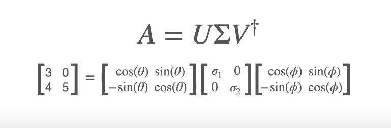
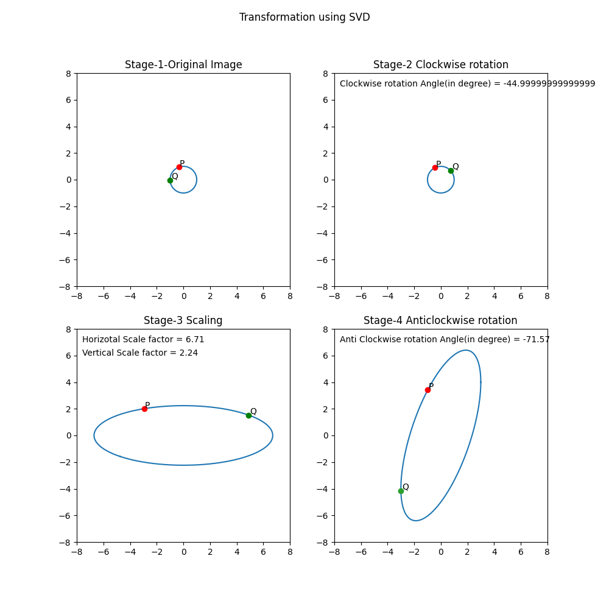

# ML_Image_Transformation
Image transformation using SVD (Singular Value Decomposition) is a technique for compressing and manipulating images. SVD is a matrix factorization method that factorizes a matrix into three matrices, including a diagonal matrix, a left singular vector matrix, and a right singular vector matrix. 

Given a matrix A, the SVD is a factorization of the form:

## A = U * S * V^T

where U and V are orthogonal matrices, and S is a diagonal matrix of singular values. 

 
U is called anti-clockwise rotation matrix
S is scaling matrix. First element is horizontal scaling factor and the second image is vertical scaling factor.
V^T is clockwise totation matrix.

On matrix multiplication of this matrices with a 2D image will result in corresponding transformation.

